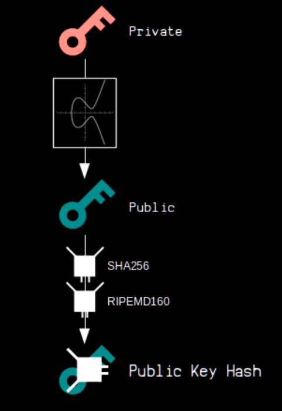
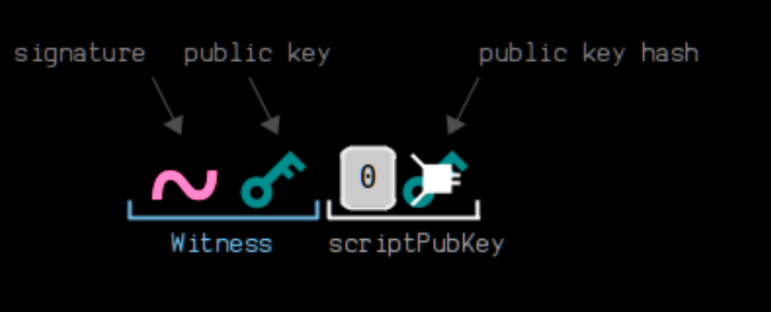
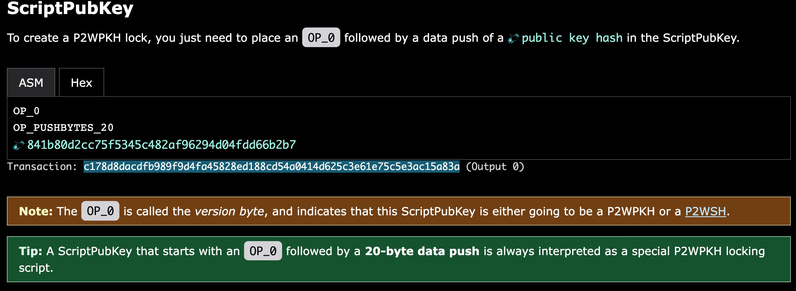
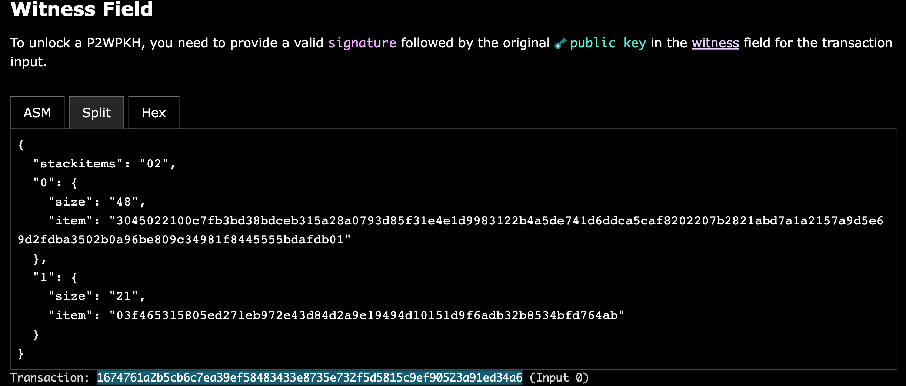
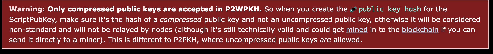
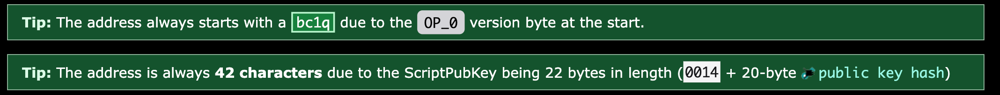

# Wallet
- [Wallet](#wallet)
  - [P2PK(pay to public key)](#p2pkpay-to-public-key)
    - [ScriptPubKey](#scriptpubkey)
    - [ScriptSig](#scriptsig)
    - [Address](#address)
  - [P2PKH(pay to public key hash)](#p2pkhpay-to-public-key-hash)
    - [ScriptPubKey](#scriptpubkey-1)
    - [ScriptSig](#scriptsig-1)
    - [Address](#address-1)
  - [P2MS(pay to multi signature)](#p2mspay-to-multi-signature)
    - [ScriptPubKey](#scriptpubkey-2)
    - [ScriptSig](#scriptsig-2)
    - [Address](#address-2)
  - [P2SH(pay to script hash)](#p2shpay-to-script-hash)
    - [ScriptPubKey](#scriptpubkey-3)
    - [ScriptSig](#scriptsig-3)
    - [Execution](#execution)
    - [Address](#address-3)
  - [P2WPKH(pay to witness public key hash)](#p2wpkhpay-to-witness-public-key-hash)
    - [Script](#script)
    - [Address](#address-4)
  - [P2WSH(pay to witness script hash)](#p2wshpay-to-witness-script-hash)
## P2PK(pay to public key)

### ScriptPubKey

### ScriptSig

### Address
- A P2PK does not have an official address.
## P2PKH(pay to public key hash)

### ScriptPubKey

### ScriptSig

### Address

- Different versions
    - p2pkh: 00
    - p2sh: 05
    - p2pkh(testnet): 6f
    - p2sh(testnet): c4
- Uncompressed address to compressed address

## P2MS(pay to multi signature)

### ScriptPubKey

### ScriptSig

### Address
- A raw P2MS locking script does not have an address.
- The most common method for using P2MS (multisig) locking scripts is to wrap them in a P2SH or P2WSH.

## P2SH(pay to script hash)

### ScriptPubKey

### ScriptSig
- ScriptSig contains the complete unlocking script and locking script.

### Execution
- A P2SH script is executed in two steps:
  - Step 1: Standard Script Execution — The Redeem Script is hashed and checked that it equals the Script Hash.
  - Step 2: Redeem Script Execution (special part) — The Redeem Script is deserialized and ran as if it were the locking script.
### Address

## P2WPKH(pay to witness public key hash)
### Script

- It works in the same way as a legacy P2PKH, but it gets unlocked via the Witness field instead of the ScriptSig.
- Script pubkey

- Witness field

- Execution
](pictures/image-3.png)
### Address
- The address for a P2WPKH locking script is the Bech32 encoding of the ScriptPubKey. The ScriptPubKey for a P2WPKH has the following structure: 0014<20-byte hash160(public key)>

## P2WSH(pay to witness script hash)