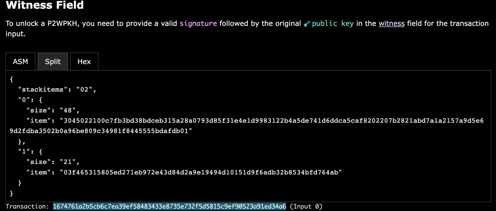

# Wallet
- [Wallet](#wallet)
  - [P2PK(pay to public key)](#p2pkpay-to-public-key)
    - [ScriptPubKey](#scriptpubkey)
    - [ScriptSig](#scriptsig)
    - [Address](#address)
  - [P2PKH(pay to public key hash)](#p2pkhpay-to-public-key-hash)
    - [ScriptPubKey](#scriptpubkey-1)
    - [ScriptSig](#scriptsig-1)
    - [Address](#address-1)
  - [P2MS(pay to multi signature)](#p2mspay-to-multi-signature)
    - [ScriptPubKey](#scriptpubkey-2)
    - [ScriptSig](#scriptsig-2)
    - [Address](#address-2)
  - [P2SH(pay to script hash)](#p2shpay-to-script-hash)
    - [ScriptPubKey](#scriptpubkey-3)
    - [ScriptSig](#scriptsig-3)
    - [Execution](#execution)
    - [Address](#address-3)
  - [P2WPKH(pay to witness public key hash)](#p2wpkhpay-to-witness-public-key-hash)
    - [ScriptPubKey](#scriptpubkey-4)
    - [ScriptPubKey](#scriptpubkey-5)
    - [Witness field](#witness-field)
    - [Address](#address-4)
  - [P2WSH(pay to witness script hash)](#p2wshpay-to-witness-script-hash)
    - [Execution](#execution-1)
## P2PK(pay to public key)

### ScriptPubKey

### ScriptSig

### Address
- A P2PK does not have an official address.
## P2PKH(pay to public key hash)

### ScriptPubKey

### ScriptSig

### Address

- Different versions
    - p2pkh: 00
    - p2sh: 05
    - p2pkh(testnet): 6f
    - p2sh(testnet): c4
- Uncompressed address to compressed address

## P2MS(pay to multi signature)

### ScriptPubKey

### ScriptSig

### Address
- A raw P2MS locking script does not have an address.
- The most common method for using P2MS (multisig) locking scripts is to wrap them in a P2SH or P2WSH.

## P2SH(pay to script hash)

### ScriptPubKey

### ScriptSig
- ScriptSig contains the complete unlocking script and locking script.

### Execution
- A P2SH script is executed in two steps:
  - Step 1: Standard Script Execution — The Redeem Script is hashed and checked that it equals the Script Hash.
  - Step 2: Redeem Script Execution (special part) — The Redeem Script is deserialized and ran as if it were the locking script.
### Address

## P2WPKH(pay to witness public key hash)

- It works in the same way as a legacy P2PKH, but it gets unlocked via the Witness field instead of the ScriptSig.
### ScriptPubKey

### ScriptPubKey
- The ScriptSig must be empty.
### Witness field

- Execution
](pictures/image-3.png)
### Address
- The address for a P2WPKH locking script is the Bech32 encoding of the ScriptPubKey. The ScriptPubKey for a P2WPKH has the following structure: 0014<20-byte hash160(public key)>

- In short, the upgrade added a new section to transactions called the Witness, which is used for unlocking the inputs to a transaction (in place of the old ScriptSig field). The reason was so that the TXIDs would no longer be influenced by the signatures inside the transaction data, as these signatures could be adjusted before the transaction gets mined, which in turn would change the TXID (which is annoying).
## P2WSH(pay to witness script hash)

### Execution
