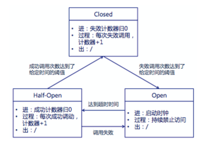
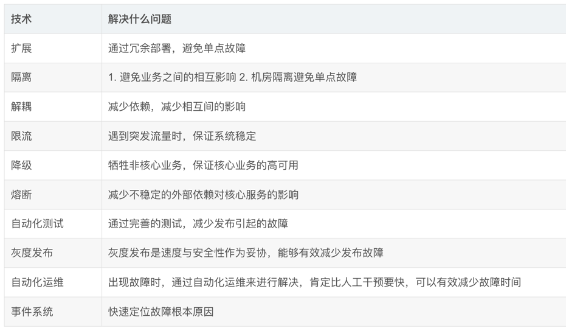

# 常见技术方案
## 扩展
- 扩展可以分为垂直扩展和水平扩展。
- 在实际应用中，水平扩展最常见： 
  - 通常我们在部署应用服务器的时候，都会部署多台，然后使用 nginx 来做负载均衡，nginx 使用心跳机制来检测服务器的正常与否，无响应的服务就从集群中剔除。这样的集群中每台服务器的角色是相同的，同时提供一样的服务；
  - 在数据库的部署中，为了防止单点故障，一般会使用一主多从，通常写操作只发生在主库。不同数据库之间角色不同。当主机宕机时，一台从库可以自动切换为主机提供服务。
## 隔离
- 隔离，是对什么进行隔离呢？是对系统、业务所占有的资源进行隔离，限制某个业务对资源的占用数量，避免一个业务占用整个系统资源，对其他业务造成影响。 
- 隔离级别按粒度从小到大，可以分为线程池隔离、进程隔离、模块隔离、应用隔离、机房隔离。在数据库的使用中，还经常用到读写分离。 
  - 线程池隔离：不同的业务使用不同的线程池，避免低优先级的任务阻塞高优先级的任务。或者高优先级的任务过多，导致低优先级任务永远不会执行。 
  - 进程隔离：Linux 中有用于进程资源隔离的 Linux CGroup，通过物理限制的方式为进程间资源控制提供了简单的实现方式，为 Linux Container 技术、虚拟化技术的发展奠定了技术基础。在工作中的实际应用，可以看看这篇文章：日志压缩资源消耗优化: Linux CGroup 的使用。 
  - 模块隔离、应用隔离：很多线上故障的发生源于代码修改后，测试不到位导致。按照代码或业务的易变程度来划分模块或应用，把变化较少的划分到一个模块或应用中，变化较多的划分到另一个模块或应用中。减少代码修改影响的范围，也就减少了测试的工作量，减少了故障出现的概率。 
  - 机房隔离：主要是为了避免单个机房网络问题或断电吧。 
  - 读写分离：一方面，将对实时性要求不高的读操作，放到 DB 从库上执行，有利于减轻 DB 主库的压力。另一方面，将一些耗时离线业务 sql 放到 DB 从库上执行，能够减少慢 sql 对 DB 主库的影响，保证线上业务的稳定可靠。
## 限流
- 一个系统的处理能力是有上限的，当服务请求量超过处理能力，通常会引起排队，造成响应时间迅速提升。如果对服务占用的资源量没有约束，还可能因为系统资源占用过多而宕机。因此，为了保证系统在遭遇突发流量时，能够正常运行，需要为你的服务加上限流。 
- 常见的限流算法有：漏桶、令牌桶、滑动窗口计数。
## 降级
- 在后台通过开关控制，降级部分非主流程的业务功能，减轻系统依赖和性能损耗，从而提升集群的整体吞吐率。降级的重点是：业务之间有优先级之分。降级的典型应用是：电商活动期间关闭非核心服务，保证核心买买买业务的正常运行。 
- 业务降级通常需要通过开关工作，开关一般做成配置放在专门的配置系统，配置的修改最好能够实时生效，毕竟要是还得修改代码发布那就太 low 了。
## 解耦
- 接口交互。
- 将同步调用转换成异步消息交互。
## 熔断
- 在分布式系统中，如果调用的远程服务或者资源由于某种原因无法使用时，没有这种过载保护，就会导致请求阻塞在服务器上等待从而耗尽服务器资源。很多时候刚开始可能只是系统出现了局部的、小规模的故障，然而由于种种原因，故障影响的范围越来越大，最终导致了全局性的后果。而这种过载保护就是大家俗称的熔断器(Circuit Breaker)。
- 熔断器的三个状态：
  - 服务正常运行时的 Closed 状态，当服务调用失败量或失败率达到阈值时，熔断器进入 Open 状态；
  - 在 Open 状态，服务调用不会真正去请求外部资源，会快速失败；
  - 当进入 Open 状态一段时间后，进入 Half-Open状态，需要去尝试调用几次服务，检查故障的服务是否恢复。如果成功则熔断器关闭，如果失败，则再次进入 Open 状态。

## 其他
- 设置超时：请求对外接口的时候，需要设置合理的超时时间，避免外部接口挂掉时，阻塞整个系统。 
- 失败重试：失败重试能够提高成功率，但是也会造成响应时间变慢，服务提供方压力倍增。具体要不要重试要根据具体情况决定：对响应时间有要求吗？接口失败率如何？重试会不会造成雪崩？
## 总结

## Reference
[1] https://blog.csdn.net/hustspy1990/article/details/78008324