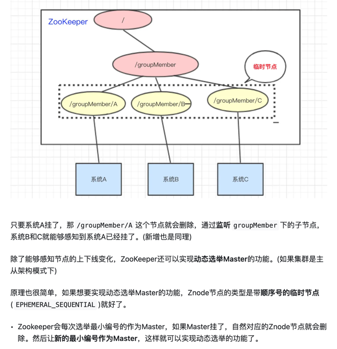

# 服务注册与发现
## 服务注册
### 自注册模式（The Self-Registration Pattern）

- 在self-registration模式中，服务实例负责从服务注册表中注册和注销。如果需要的话，一个服务实例发送心跳请求防止注册过期。
### 第三方注册模式（The Third-Party Registration Pattern）
- 在third-party registration模式中，服务实例不会自己在服务注册表中注册，由另一个系统组件service registrar负责。service registrar通过轮询部署环境或订阅事件去跟踪运行中的实例的变化。当它注意到一个新的可用的服务实例时，就会到注册表中去注册。service registrar也会将停止的服务实例注销

## 服务发现
### 客户端服务发现模式
- 当使用客户端服务发现的时候，客户端负责决定可用的服务实例的网络地址，以及围绕他们的负载均衡。客户端向服务注册表（service registry）发送一个请求，服务注册表是一个可用服务实例的数据库。客户端使用一个负载均衡算法，去选择一个可用的服务实例，来响应这个请求

### 服务器端服务发现模式
- 客户端通过负载均衡器向一个服务发送请求，这个负载均衡器会查询服务注册表，并将请求路由到可用的服务实例上。通过客户端的服务发现，服务实例在服务注册表上被注册和注销。
- 服务器端服务发现模式也是优势和缺陷并存。最大的好处在于服务发现的细节被从客户端中抽象出来，客户端只需要向负载均衡器发送请求，不需要为服务客户端使用的每一种语言和框架，实现服务发现逻辑；另外，这种模式也有一些问题，除非这个负载均衡器是由部署环境提供的，又是另一个高需要启动和管理的可用的系统组件。

## Zookeeper组成部分

- 服务提供者
- 服务注册中心
  - 服务注册中心主要提供所有服务注册信息的中心存储，同时负责将服务注册信息的更新通知实时的Push给服务消费者(主要是通过Zookeeper的Watcher机制来实现的)。
- 服务消费者 
  - 服务消费者在启动时从服务注册中心获取需要的服务注册信息； 
  - 将服务注册信息缓存在本地； 
  - 监听服务注册信息的变更，如接收到服务注册中心的服务变更通知，则在本地缓存中更新服务的注册信息 
  - 根据本地缓存中的服务注册信息构建服务调用请求，并根据负载均衡策略(随机负载均衡，Round-Robin负载均衡等)来转发请求 
  - 对服务提供方的存活进行检测，如果出现服务不可用的服务提供方，将从本地缓存中剔除 
  - 服务消费者只在自己初始化以及服务变更时会依赖服务注册中心，在此阶段的单点故障通过Zookeeper集群来进行保障。在整个服务调用过程中，服务消费者不依赖于任何第三方服务
## Zookeeper数据结构
- 结合数据结构，通过watcher监听`Znode节点的数据变化`和`子节点的增减变化`

## Zookeeper功能
### 统一配置管理

### 统一命名服务

### 分布式锁

### 集群状态

## 实现机制

## Reference
[1] https://www.51cto.com/article/502394.html

[2] https://zhuanlan.zhihu.com/p/62526102