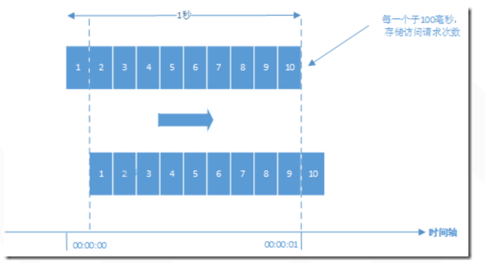
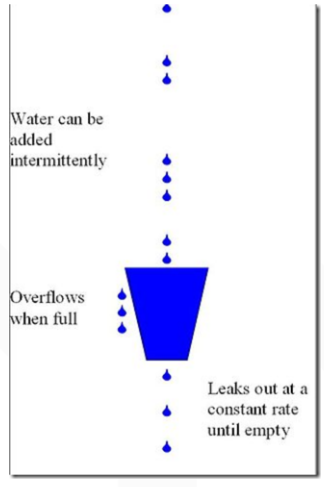
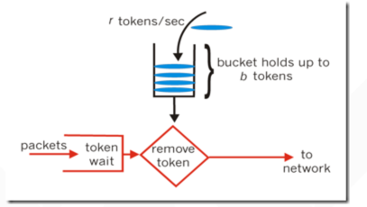
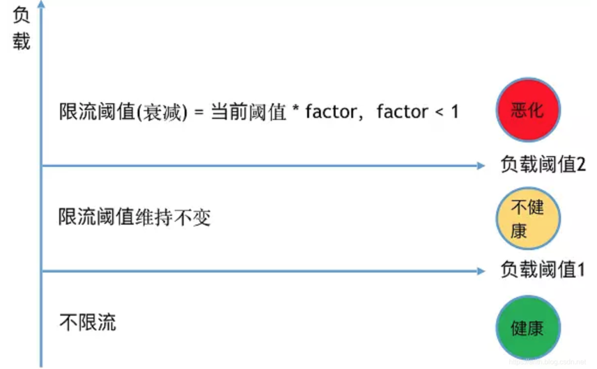

# 缓存，降级和限流
- 在开发高并发系统时有三把利器用来保护系统：缓存、降级和限流。
## 缓存
- 大型网站一般主要是“读”，缓存的使用很容易被想到。在大型“写”系统中，缓存也常常扮演者非常重要的角色。比如累积一些数据批量写入，内存里面的缓存队列（生产消费），以及HBase写数据的机制等等也都是通过缓存提升系统的吞吐量或者实现系统的保护措施。甚至消息中间件，你也可以认为是一种分布式的数据缓存。
## 降级
- 降级往往会指定不同的级别，面临不同的异常等级执行不同的处理。根据服务方式：可以拒接服务，可以延迟服务，也有时候可以随机服务。根据服务范围：可以砍掉某个功能，也可以砍掉某些模块。总之服务降级需要根据不同的业务需求采用不同的降级策略。主要的目的就是服务虽然有损但是总比没有好。
## 限流
- 限流可以认为服务降级的一种，限流就是限制系统的输入和输出流量已达到保护系统的目的。一般来说系统的吞吐量是可以被测算的，为了保证系统的稳定运行，一旦达到的需要限制的阈值，就需要限制流量并采取一些措施以完成限制流量的目的。比如：延迟处理，拒绝处理，或者部分拒绝处理等等。
### 限流算法
- 常见的限流算法有：计数器、漏桶和令牌桶算法。
#### 计数器
- 计数器是最简单粗暴的算法。比如某个服务最多只能每秒钟处理100个请求。我们可以设置一个1秒钟的滑动窗口，窗口中有10个格子，每个格子100毫秒，每100毫秒移动一次，每次移动都需要记录当前服务请求的次数。内存中需要保存10次的次数。可以用数据结构LinkedList来实现。格子每次移动的时候判断一次，当前访问次数和LinkedList中最后一个相差是否超过100，如果超过就需要限流了。

#### 漏桶
- 漏桶算法即leaky bucket是一种非常常用的限流算法，可以用来实现流量整形（Traffic Shaping）和流量控制（Traffic Policing）。

- 漏桶算法的主要概念如下： 
  - 一个固定容量的漏桶，按照常量固定速率流出水滴； 
  - 如果桶是空的，则不需流出水滴； 
  - 可以以任意速率流入水滴到漏桶； 
  - 如果流入水滴超出了桶的容量，则流入的水滴溢出了（被丢弃），而漏桶容量是不变的。
- 漏桶算法可以使用 Redis 队列来实现，生产者发送消息前先检查队列长度是否超过阈值，超过阈值则丢弃消息，否则发送消息到 Redis 队列中；消费者以固定速率从 Redis 队列中取消息。Redis 队列在这里起到了一个缓冲池的作用，起到削峰填谷、流量整形的作用。
#### 令牌桶
- 令牌桶算法是一个存放固定容量令牌（token）的桶，按照固定速率往桶里添加令牌。令牌桶算法基本可以用下面的几个概念来描述： 
  - 令牌将按照固定的速率被放入令牌桶中。比如每秒放10个。 
  - 桶中最多存放b个令牌，当桶满时，新添加的令牌被丢弃或拒绝。 
  - 当一个n个字节大小的数据包到达，将从桶中删除n个令牌，接着数据包被发送到网络上。 
  - 如果桶中的令牌不足n个，则不会删除令牌，且该数据包将被限流（要么丢弃，要么缓冲区等待）。
- Guava 中的限流工具 RateLimiter，其原理就是令牌桶算法。

- 令牌算法是根据放令牌的速率去控制输出的速率，也就是上图的to network的速率。to network我们可以理解为消息的处理程序，执行某段业务或者调用某个RPC。
- 漏桶和令牌桶的比较：令牌桶可以在运行时控制和调整数据处理的速率，处理某时的突发流量。放令牌的频率增加可以提升整体数据处理的速度，而通过每次获取令牌的个数增加或者放慢令牌的发放速度和降低整体数据处理速度。而漏桶不行，因为它的流出速率是固定的，程序处理速度也是固定的。
### 动态限流
- 一般情况下的限流，都需要我们手动设定限流阈值，不仅繁琐，而且容易因系统的发布升级而过时。为此，我们考虑根据系统负载来动态决定是否限流，动态计算限流阈值。可以参考的系统负载参数有：Load、CPU、接口响应时间等。

### 限流算法实现 - Nginx
- 对于Nginx接入层限流可以使用Nginx自带了两个模块：连接数限流模块ngx_http_limit_conn_module和漏桶算法实现的请求限流模块ngx_http_limit_req_module。
#### ngx_http_limit_conn_module
- 我们经常会遇到这种情况，服务器流量异常，负载过大等等。对于大流量恶意的攻击访问，会带来带宽的浪费，服务器压力，影响业务，往往考虑对同一个ip的连接数，并发数进行限制。ngx_http_limit_conn_module 模块来实现该需求。该模块可以根据定义的键来限制每个键值的连接数，如同一个IP来源的连接数。并不是所有的连接都会被该模块计数，只有那些正在被处理的请求（这些请求的头信息已被完全读入）所在的连接才会被计数。
#### ngx_http_limit_req_module
- 上面我们使用到了ngx_http_limit_conn_module 模块，来限制连接数。那么请求数的限制该怎么做呢？这就需要通过ngx_http_limit_req_module 模块来实现，该模块可以通过定义的键值来限制请求处理的频率。特别的，可以限制来自单个IP地址的请求处理频率。 限制的方法是使用了漏斗算法，每秒固定处理请求数，推迟过多请求。如果请求的频率超过了限制域配置的值，请求处理会被延迟或被丢弃，所以所有的请求都是以定义的频率被处理的。

## Reference
[1] https://www.cnblogs.com/haoxinyue/p/6792309.html

